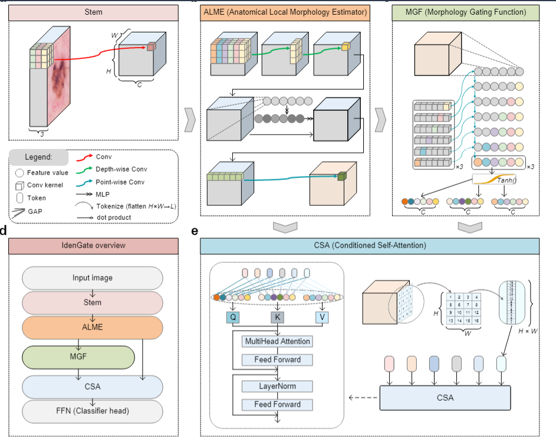

# IdenGate

The ablation directory contains files related to a subset of the ablation studies.
Specifically, the derma_MGF folder focuses on ablation experiments of the MGF module, while retina_layer investigates the impact of network depth and the gating strength parameter α through systematic ablations.

The comparison directory includes the baseline and state-of-the-art models used for comparative experiments on the MedMNIST benchmarks.

The eval directory is provided to facilitate reproducibility. It includes separate training and evaluation Python scripts, along with the corresponding CSV result files obtained in our experiments. These CSV files record overall accuracy (Acc), AUC, and per-class accuracy.

The figure directory contains the code and data used for figure generation.
In particular, noise_translation provides the scripts for generating plots under noise perturbation and pixel-level translation, while risk_reliable includes the code for producing risk–coverage and reliability-related figures.

We recommend that you download the complete code and reproduce the results using the scripts in the eval folder. We provide CSV files for both the training process and the evaluation process, as well as the trained weight files.

MedMNIST: https://medmnist.com/ and https://zenodo.org/records/10519652

Complete code including the weight files: https://drive.google.com/file/d/1XxHp0Ru-RagJBk7oaZyKUAuaZXVrynEq/view?usp=sharing

