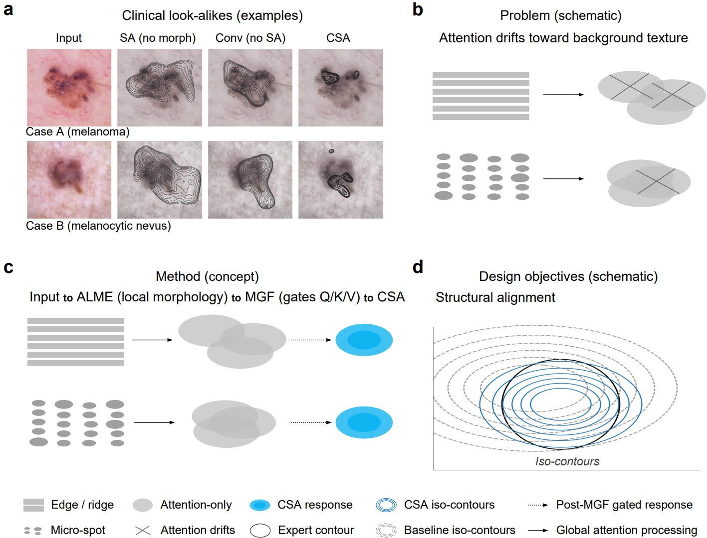
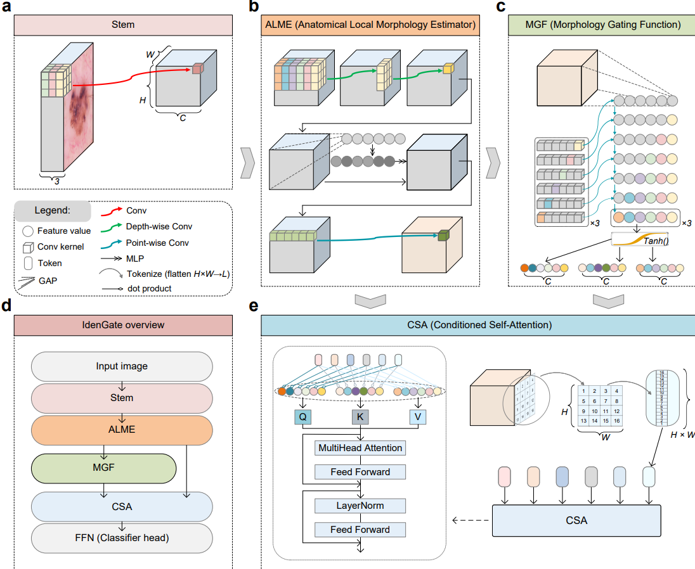
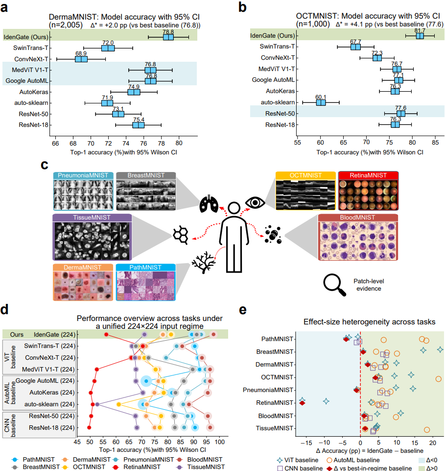

# IdenGate

Deep models can be confident for the wrong reasons: under shortcut learning, internal evidence (class-activation maps) drifts from causal structure while predictions remain overconfident. We introduce IdenGate, a morphology-aware inductive bias that geometrically stabilizes self-attention via near-identity gating of token embeddings feeding Q/K/V; gate strength interpolates to the unconditioned baseline at zero, preserving expressivity while steering aggregation toward contiguous morphology. Across eight MedMNIST tasks and three external clinical datasets, IdenGate improves calibration and risk-coverage and yields more lesion-centric evidence. In a randomized cross-over reader study on RetinaMNIST (400 readings), AI assistance increased clinician confidence by 3.94 points (95%CI 1.52–6.36) without increasing decision time (-0.19 s, 95% CI -1.10 to 0.79) and improved clinician confidence–accuracy calibration (ECE13.2%→7.0%). Weak, near-identity structural constraints can thus align evidence and confidence, offering a general route to safer human–AI decision support.

We recommend that you download the complete code and reproduce the results using the scripts in the eval folder. We provide CSV files for both the training process and the evaluation process, as well as the trained weight files.

MedMNIST: https://medmnist.com/ and https://zenodo.org/records/10519652

Complete code including the weight files and retina dataset: https://drive.google.com/file/d/1XxHp0Ru-RagJBk7oaZyKUAuaZXVrynEq/view?usp=sharing

