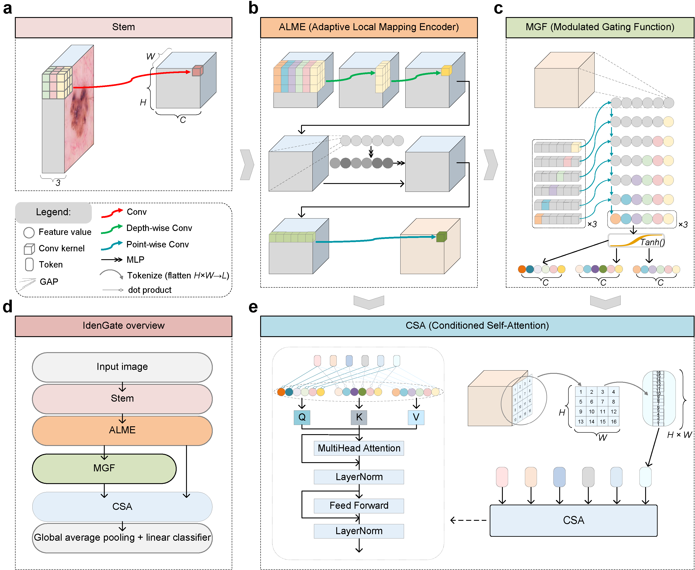

# IDENGATE

## Bounded Role-Specific Preprojection Gating with Exact Identity Control for Medical Image Classification

Official implementation and reproducibility package for **IDENGATE**, a compact medical-image classification architecture that applies bounded, sample-specific, role-specific gates before the query, key, and value projections of self-attention.

> **Core idea.** IDENGATE conditions affinity formation and content aggregation through separate near-identity gates while leaving scaled dot-product attention unchanged. Setting the gate strength to zero restores exact identity gates within the same trained checkpoint, enabling fixed-checkpoint mechanistic interventions without retraining.

---

## 1. Method overview

Given an input image \(x\), a convolutional stem produces

\[
F \in \mathbb{R}^{B\times C\times H\times W}.
\]

IDENGATE combines three components:

1. **Adaptive Local Mapping Encoder (ALME)** — forms a locally filtered feature map and an image-level descriptor.
2. **Modulated Gating Function (MGF)** — generates separate unit-centered gates for the query, key, and value paths.
3. **Conditioned Self-Attention (CSA)** — applies those gates in the shared input-channel space before the three projections.

The resulting architecture converts fixed Q/K/V projections into image-specific effective projections while retaining the standard attention operator.

<p align="center">
  
</p>

---

## 2. Mathematical correspondence to the paper

### 2.1 Role-specific preprojection conditioning

After tokenization,

\[
X \in \mathbb{R}^{B\times L\times C}, \qquad L=HW.
\]

For each path \(r\in\{Q,K,V\}\), MGF produces a sample-specific channel gate

\[
\phi^{(r)}(x;\alpha)\in\mathbb{R}^{B\times C},
\]

broadcast over the token dimension. For one sample,

\[
D_r(x;\alpha)=\operatorname{diag}\!\left(\phi^{(r)}(x;\alpha)\right)
\in\mathbb{R}^{C\times C}.
\]

The three attention paths are

\[
Q=XD_QW_Q,\qquad
K=XD_KW_K,\qquad
V=XD_VW_V,
\]

followed by

\[
\operatorname{Attn}(Q,K,V)
=
\operatorname{softmax}\!\left(\frac{QK^\top}{\sqrt d}\right)V.
\]

The sample-specific effective projection is

\[
W_r^{\mathrm{eff}}(x;\alpha)=D_r(x;\alpha)W_r.
\]

The gates act before head partitioning in the shared \(C\)-dimensional input space. Output projection, residual connections, normalization layers, feed-forward layers, and the scaled dot-product attention operator remain unchanged.

### 2.2 Adaptive Local Mapping Encoder

ALME introduces local information before spatial pooling:

\[
\begin{aligned}
Z &= \operatorname{BN}\!\left(\operatorname{DWConv}_{3\times3}(F)\right),\\
s &= \sigma\!\left(h(\operatorname{GAP}(Z))\right),\\
\widehat F &= \operatorname{Conv}_{1\times1}(Z\odot s),\\
m &= \operatorname{GAP}(\widehat F)\in\mathbb{R}^{B\times C}.
\end{aligned}
\]

Here, \(h\) is a two-layer multilayer perceptron, \(\sigma\) is the sigmoid function, and \(\odot\) denotes channel-wise multiplication.

### 2.3 Modulated Gating Function

For each role \(r\in\{Q,K,V\}\),

\[
g_r(m)=a_r\odot m+b_r,
\]

\[
\phi^{(r)}(x;\alpha)
=
\mathbf{1}+\alpha\tanh\!\left(g_r(m(x))\right).
\]

The role-specific parameters \(a_r,b_r\in\mathbb{R}^C\) are learned independently and initialized at zero.

The primary operating point is

\[
\alpha=0.1,
\]

which guarantees

\[
\phi^{(r)}(x;0.1)\in[0.9,1.1]^C.
\]

### 2.4 Exact identity state

For any input and learned parameters,

\[
D_Q(x;0)=D_K(x;0)=D_V(x;0)=I_C.
\]

This is the exact identity-gate state of the **same checkpoint trained with gating**. It preserves:

- learned projection weights;
- normalization statistics;
- ALME and descriptor computations;
- all non-gating model parameters;
- the input and preprocessing pipeline.

It is not a separately trained model without MGF.

### 2.5 Structural properties

A nonconstant preprojection gate is generally not equivalent to diagonal scaling after projection. Equality would require

\[
DW=WG
\]

for a diagonal \(G\), implying

\[
(d_i-g_j)W_{ij}=0
\]

for every \(i,j\). For a dense projection matrix with a column containing nonzero entries in rows with different \(d_i\), no such diagonal \(G\) exists.

The unit-centered parameterization gives

\[
\|D_r(x;\alpha)-I_C\|_2\leq \alpha,
\]

and, for \(\nu\in\{2,F\}\),

\[
\|P_r(\alpha)-P_r(0)\|_\nu
\leq
\alpha\|X\|_\nu\|W_r\|_2,
\]

where \(P_r(\alpha)=XD_r(x;\alpha)W_r\).

For one attention head \(h\),

\[
\left\|S_\alpha^{(h)}-S_0^{(h)}\right\|_2
\leq
\frac{(2\alpha+\alpha^2)\|X\|_2^2
\|W_Q^{(h)}\|_2\|W_K^{(h)}\|_2}{\sqrt d}.
\]

---

## 3. Terminology

These terms are not interchangeable.

| Term | Exact definition |
|---|---|
| **IDENGATE** | Full architecture containing ALME, MGF, and CSA. |
| **MGF ON** | Learned-gate state of an IDENGATE checkpoint, with \(\alpha=0.1\). |
| **MGF OFF** | Exact identity-gate state of the same checkpoint, with \(\alpha=0\). |
| **no-MGF** | Separately trained model in which MGF is absent. This is not MGF OFF. |
| **Shuffle-MGF** | Parameter-matched control preserving the mini-batch gate-vector multiset while breaking image–gate correspondence. |
| **Q/K/V identity intervention** | Only the selected learned gate is replaced by identity at inference; all other computations remain fixed. |
| **standard-attention control** | CSA is replaced by parameter-matched eight-head standard self-attention. |
| **ALME replacement control** | ALME is replaced by the reported ResNet-18 alternative. |

All scripts, configurations, result files, and figures should use these definitions exactly.

---

## 4. Reproducibility scope

The public release supports the paper's computational evidence chain:

- construction of ALME, MGF, CSA, and IDENGATE;
- training and validation-based checkpoint selection;
- evaluation on eight 2D MedMNIST tasks;
- evaluation on FetalPlanesDB, CPN X-ray, and PAD-UFES-20;
- no-MGF, Shuffle-MGF, standard-attention, and ALME-replacement controls;
- fixed-checkpoint Q/K/V identity interventions;
- Gaussian-noise, contrast-reduction, and translation analyses;
- validation-fitted temperature scaling and 10-bin ECE;
- empirical risk–coverage curves and AURC;
- Grad-CAM overlap on paired expert-annotated subsets;
- generation of paper tables and figures from released result files.

### External comparator scope

The MedMNIST comparator values in the cross-task figure are source-reported values from the cited studies. The additional-dataset comparator values are reproduced from the multi-model benchmark cited in the manuscript.

External comparators were not retrained under common data partitions, optimization settings, or metric implementations. They provide accuracy and parameter-count context. Mechanistic conclusions rely on controlled within-model experiments.

### Reader-study scope

The retrospective reader study is exploratory. Raw reader identities and non-public individual-level records are not part of the source repository. Any released reader-study material must be de-identified and limited to the approved reproducibility scope.

---

## 5. Repository organization

```text
IDENGATE/
├── README.md
├── LICENSE
├── CITATION.cff
├── environment.yml
├── requirements.txt
│
├── idengate/
│   ├── models/
│   │   ├── alme.py
│   │   ├── mgf.py
│   │   ├── csa.py
│   │   └── idengate.py
│   ├── data/
│   │   ├── medmnist.py
│   │   ├── fetalplanesdb.py
│   │   ├── cpn_xray.py
│   │   └── pad_ufes20.py
│   ├── evaluation/
│   │   ├── classification.py
│   │   ├── calibration.py
│   │   ├── risk_coverage.py
│   │   ├── perturbations.py
│   │   └── gradcam_overlap.py
│   └── utils/
│       ├── checkpointing.py
│       ├── reproducibility.py
│       ├── statistics.py
│       └── manifests.py
│
├── configs/
│   ├── medmnist/
│   ├── external/
│   ├── controls/
│   └── analysis/
│
├── scripts/
│   ├── train.py
│   ├── evaluate.py
│   ├── identity_intervention.py
│   ├── perturbation_analysis.py
│   ├── calibration_analysis.py
│   └── gradcam_analysis.py
│
├── reproduce/
│   ├── reproduce_all.py
│   ├── reproduce_table_ii.py
│   ├── reproduce_table_iii.py
│   ├── reproduce_figure_3.py
│   ├── reproduce_figure_4.py
│   ├── reproduce_figure_5.py
│   └── reproduce_figure_6.py
│
├── metadata/
│   ├── dataset_splits/
│   ├── checkpoint_manifest.csv
│   ├── expected_results.csv
│   └── file_hashes.sha256
│
├── checkpoints/
│   └── README.md
│
├── assets/
│   └── main.png
│
└── outputs/
    └── .gitkeep
```

Raw datasets and large checkpoints are not committed to the source tree. Dataset locations, exact split indices, checkpoint identifiers, and hashes are recorded separately.

---

## 6. Installation

### 6.1 Reference environment

| Component | Reference configuration |
|---|---|
| Operating system | Linux 6.14.0, x86_64, glibc 2.39 |
| Python | 3.10.13 |
| PyTorch | 2.8.0 |
| TorchVision | 0.23.0 |
| CUDA | 12.9 |
| cuDNN | 9.1 |
| GPU | NVIDIA GeForce RTX 5090 ×2 |
| CPU | AMD Ryzen 9 9950X |
| RAM | 64 GB |

Exact dependencies are recorded in `environment.yml` and `requirements.txt`.

### 6.2 Conda

```bash
git clone https://github.com/Measure-Lab/IdenGate.git
cd IdenGate

conda env create -f environment.yml
conda activate idengate
python -m pip install -e .
```

### 6.3 Pip

```bash
python -m venv .venv
source .venv/bin/activate

python -m pip install --upgrade pip
python -m pip install -r requirements.txt
python -m pip install -e .
```

Install the PyTorch build appropriate for the local CUDA driver before installing the remaining dependencies.

---

## 7. Data preparation

All inputs are resized to \(224\times224\).

### 7.1 MedMNIST v2

The study uses official 2D splits for:

- PathMNIST
- BreastMNIST
- DermaMNIST
- OCTMNIST
- PneumoniaMNIST
- RetinaMNIST
- BloodMNIST
- TissueMNIST

Source: <https://medmnist.com/>

Do not redefine train, validation, or test membership.

### 7.2 FetalPlanesDB

Source: <https://zenodo.org/records/3904280>

The protocol uses the original chronological patient-level development/test partition, with 896 patients in each cohort. A fixed image-level 10% subset of the development images is used for validation. Released indices define the exact validation subset.

### 7.3 CPN X-ray

Source: <https://data.mendeley.com/datasets/dvntn9yhd2/1>

The collection contains 5,228 images:

- 1,626 COVID-19;
- 1,802 normal;
- 1,800 pneumonia.

Because no canonical split or verified patient identifiers are available, the paper uses a fixed image-level split. Load the released assignments and seed rather than regenerating them.

### 7.4 PAD-UFES-20

Source: <https://data.mendeley.com/datasets/zr7vgbcyr2/1>

The partition is patient-disjoint: all images and lesions from one patient remain in the same subset. Use the released patient identifiers and assignments.

### 7.5 Local layout

```text
data/
├── medmnist/
├── fetalplanesdb/
├── cpn_xray/
└── pad_ufes20/
```

Dataset paths should be supplied through configuration files or command-line arguments. Source files must not be copied into the repository.

---

## 8. Primary RetinaMNIST protocol

| Setting | Value |
|---|---|
| Seeds | 42, 43, 44, 45, 46 |
| Epochs | 60 |
| Batch size | 128 |
| Optimizer | AdamW |
| Learning rate | \(3\times10^{-4}\) |
| Weight decay | \(10^{-4}\) |
| Scheduler | Cosine annealing with warm restarts |
| \(T_0\) | 10 |
| \(T_{\mathrm{mult}}\) | 2 |
| Loss | Cross-entropy |
| Checkpoint selection | Highest validation macro-AUC |
| Class weighting | None |
| Pretraining | None |
| Primary gate strength | \(\alpha=0.1\) |

All multi-seed controls, scaling studies, and fixed-checkpoint analyses use the same seed set and are matched by seed.

### Training

```bash
python scripts/train.py \
  --config configs/medmnist/retinamnist_primary.yaml \
  --seeds 42 43 44 45 46
```

### Evaluation

```bash
python scripts/evaluate.py \
  --config configs/medmnist/retinamnist_primary.yaml \
  --checkpoint-manifest metadata/checkpoint_manifest.csv \
  --gate-state learned
```

The checkpoint manifest should record:

- dataset and split version;
- seed and configuration identifier;
- selected epoch and validation macro-AUC;
- checkpoint path and SHA-256 checksum;
- source-code commit;
- environment identifier.

---

## 9. Fixed-checkpoint identity interventions

Supported states:

```text
full
q_identity
k_identity
v_identity
qk_identity
qkv_identity
```

For every intervention:

- the same checkpoint is loaded;
- inputs are identical;
- weights and normalization statistics remain fixed;
- descriptor computation remains active;
- non-intervened gates remain unchanged;
- only selected gate matrices are replaced by identity.

```bash
python scripts/identity_intervention.py \
  --config configs/analysis/retinamnist_identity_interventions.yaml \
  --checkpoint-manifest metadata/checkpoint_manifest.csv \
  --states full q_identity k_identity v_identity qk_identity qkv_identity
```

### Statistical protocol

For each state and seed:

- accuracy and one-vs-rest macro-AUC are evaluated on the official test split;
- ECE uses 10 equal-width bins;
- a temperature is fitted to the corresponding validation logits by negative-log-likelihood minimization and fixed for test evaluation;
- selective prediction uses maximum-softmax confidence;
- AURC is obtained by trapezoidal integration of empirical risk over coverage;
- prediction change is measured relative to Full;
- intervention differences are paired by seed;
- nominal 95% CIs use Student's \(t\) distribution with four degrees of freedom.

---

## 10. Control experiments

### no-MGF

A separately trained model with MGF removed. It must never be produced or labeled by setting \(\alpha=0\).

### Shuffle-MGF

Preserves architecture, parameter count, and the mini-batch gate-vector multiset while breaking image–gate correspondence. The permutation must remain within the current mini-batch.

### Standard-attention control

CSA is replaced by parameter-matched eight-head standard self-attention.

### ALME replacement control

The reported control uses the ResNet-18 replacement described in the paper. Because it is larger than IDENGATE, summaries must report its actual parameter count.

### Scaling studies

- training-set fractions: 10%, 25%, 50%, 100%;
- IDENGATE depths: 1, 2, 3 blocks;
- seeds: 42–46.

The three-block configuration is retained because it achieves the highest macro-AUC, although the one-block model has the highest reported accuracy in the depth study.

---

## 11. Perturbation and gate-strength analysis

Perturbations are applied **after resizing and before normalization**.

Gaussian noise:

\[
\sigma\in\{0.05,0.10,0.15,0.20,0.25\}.
\]

Contrast:

\[
c\in\{0.80,0.75,0.70,0.65,0.60\}.
\]

Translation:

\[
t\in\{2,4,6,8,10\}\text{ pixels}.
\]

Each checkpoint is evaluated as a paired comparison:

- MGF ON: \(\alpha=0.1\);
- MGF OFF: \(\alpha=0\).

```bash
python scripts/perturbation_analysis.py \
  --config configs/analysis/retinamnist_perturbations.yaml \
  --checkpoint-manifest metadata/checkpoint_manifest.csv
```

### Extended fixed-weight sweep

\[
\alpha\in\{0,0.5,1,2,4\}
\]

is evaluated without updates. The primary \(\alpha=0.1\) operating point is handled in the paired learned-versus-identity analysis. Values above one are over-conditioning stress tests and may permit negative multipliers; they are not proposed deployment settings.

---

## 12. Calibration and selective prediction

ECE uses 10 equal-width bins. Temperature scaling is fitted separately on the corresponding validation logits for each checkpoint and gate state and is then fixed for test evaluation.

Selective prediction uses maximum-softmax confidence. Risk is the empirical error rate among retained predictions at each coverage level. AURC is computed using trapezoidal integration.

```bash
python scripts/calibration_analysis.py \
  --config configs/analysis/retinamnist_calibration.yaml \
  --checkpoint-manifest metadata/checkpoint_manifest.csv
```

MGF ON and MGF OFF must never be presented as separately trained models.

---

## 13. Activation-map analysis

Grad-CAM maps are:

1. generated for paired MGF ON and MGF OFF states of the same checkpoint;
2. resized to expert-annotation resolution;
3. thresholded at the 85th activation percentile;
4. compared with fixed expert masks using IoU and Dice.

The paired 20-image subsets are:

- RetinaMNIST proliferative diabetic retinopathy;
- DermaMNIST melanocytic nevus.

```bash
python scripts/gradcam_analysis.py \
  --config configs/analysis/gradcam_overlap.yaml \
  --checkpoint-manifest metadata/checkpoint_manifest.csv
```

This analysis is exploratory and should not be described as independent clinical localization validation.

---

## 14. Reproducing the paper

```bash
python reproduce/reproduce_table_ii.py \
  --input outputs/identity_interventions \
  --output outputs/paper/table_ii.csv

python reproduce/reproduce_figure_3.py \
  --input outputs/figure_3 \
  --output outputs/paper/figure_3

python reproduce/reproduce_figure_4.py \
  --input outputs/perturbations \
  --output outputs/paper/figure_4

python reproduce/reproduce_figure_5.py \
  --idengate-results outputs/cross_task \
  --source-values metadata/source_reported_comparators.csv \
  --output outputs/paper/figure_5

python reproduce/reproduce_figure_6.py \
  --input outputs/gradcam_overlap \
  --output outputs/paper/figure_6

python reproduce/reproduce_table_iii.py \
  --idengate-results outputs/external_datasets \
  --benchmark-values metadata/medvitv2_benchmark.csv \
  --output outputs/paper/table_iii.csv
```

Figure 5 uses archived source-reported comparator values and does not retrain the external comparator models. Table III uses the cited benchmark values.

A complete entry point is:

```bash
python reproduce/reproduce_all.py \
  --checkpoint-manifest metadata/checkpoint_manifest.csv \
  --output outputs/paper
```

Expected output:

```text
outputs/paper/
├── figures/
├── tables/
├── metrics/
├── logs/
└── run_manifest.json
```

---

## 15. Reference results

These values are paper-level verification targets, not bitwise guarantees.

### RetinaMNIST primary and controls

| State / control | Accuracy (%) | Macro-AUC (%) |
|---|---:|---:|
| IDENGATE Full | 56.75 | 75.732 |
| no-MGF | 55.75 | 75.0 |
| Shuffle-MGF | 55.75 | 75.1 |

### Role-specific identity interventions

| Gate(s) set to identity | Accuracy (%) | \(\Delta\) accuracy (pp) | Macro-AUC (%) | \(\Delta\) macro-AUC (pp) |
|---|---:|---:|---:|---:|
| None (Full) | 56.75 | — | 75.732 | — |
| Q | 56.50 | -0.25 | 75.600 | -0.132 |
| K | 56.30 | -0.45 | 75.490 | -0.242 |
| V | 56.05 | -0.70 | 75.322 | -0.410 |
| Q, K | 55.80 | -0.95 | 75.182 | -0.550 |
| Q, K, V | 55.55 | -1.20 | 75.038 | -0.694 |

### Perturbation response

| Perturbation | MGF ON decline (pp) | MGF OFF decline (pp) |
|---|---:|---:|
| Gaussian noise | 1.5 | 5.5 |
| Contrast reduction | 11.1 | 12.2 |
| Translation | 27.0 | 32.0 |

Clean-test, validation-calibrated ECE:

| Gate state | ECE |
|---|---:|
| MGF ON | 0.072 |
| MGF OFF | 0.079 |

### Activation-map overlap

| Dataset subset | Metric | MGF OFF | MGF ON |
|---|---|---:|---:|
| RetinaMNIST PDR | IoU | 0.004 | 0.027 |
| RetinaMNIST PDR | Dice | 0.009 | 0.052 |
| DermaMNIST MN | IoU | 0.010 | 0.015 |
| DermaMNIST MN | Dice | 0.020 | 0.029 |

### Additional public datasets

| Dataset | Parameters (M) | Accuracy (%) |
|---|---:|---:|
| FetalPlanesDB | 2.4 | 94.4 |
| CPN X-ray | 2.4 | 97.6 |
| PAD-UFES-20 | 2.4 | 66.1 |

Small numerical differences may arise from hardware and library kernels. A valid reproduction must preserve the protocol, checkpoint-selection rule, seed matching, intervention semantics, and aggregation procedure.

---

## 16. Paper-to-code map

| Paper element | Public implementation |
|---|---|
| Equations (1)–(5) | `idengate/models/csa.py`, `idengate/models/idengate.py` |
| Equation (6) | `idengate/models/alme.py` |
| Equations (7)–(9) | `idengate/models/mgf.py` |
| Equations (10)–(15) | `docs/STRUCTURAL_PROPERTIES.md`, verification tests |
| Table I | `metadata/dataset_splits/`, dataset configs |
| Table II | `scripts/identity_intervention.py`, `reproduce/reproduce_table_ii.py` |
| Figure 3 | control, scaling, and parameter-count scripts |
| Figure 4 | perturbation, calibration, AURC, and strength-sweep scripts |
| Figure 5 | cross-task outputs plus archived source-reported values |
| Figure 6 | Grad-CAM overlap and clean-test risk–coverage scripts |
| Table III | external-dataset outputs plus archived benchmark values |

---

## 17. Reproducibility invariants

1. MGF OFF must use the same checkpoint as MGF ON.
2. no-MGF must not be labeled MGF OFF.
3. Identity interventions modify only selected role gates.
4. ALME and descriptor computation remain active under MGF OFF.
5. Normalization statistics remain fixed during paired inference.
6. Perturbations are applied after resize and before normalization.
7. Temperature scaling is fitted on validation logits separately for each gate state.
8. Test labels do not influence checkpoint selection or calibration fitting.
9. Seed-level outputs are retained before aggregation.
10. External comparator values are marked as source reported or benchmark reproduced.
11. Split files and checkpoints carry SHA-256 hashes.
12. Every paper table and figure has one unambiguous reproduction entry point.

Automated tests should verify the exact identity property:

```python
torch.testing.assert_close(
    model(x, alpha=0.0),
    model.forward_identity_state(x),
    rtol=0.0,
    atol=0.0,
)
```

The test suite should also confirm that selected-role interventions leave all non-selected gate tensors unchanged.

---

## 18. Availability, ethics, and intended use

All model-development datasets used in the manuscript are public and de-identified.

The retrospective reader study was approved by the Sungkyunkwan University Institutional Review Board (**SKKU IRB No. 2026-01-011**). Both raters provided informed consent. The study used de-identified public images and did not affect patient care.

This repository is provided for research and reproducibility. It is not a certified medical device and must not be used for clinical diagnosis or patient-management decisions without independent validation, regulatory review, and institutional approval.

---

## 19. Citation

Until a final bibliographic record is available:

```bibtex
@misc{huang2026idengate,
  title  = {IDENGATE: Bounded Role-Specific Preprojection Gating with Exact Identity Control for Medical Image Classification},
  author = {Hao Huang and Jee-Hyong Lee and Ce Gao and Ning Wang and Zongrun Sun},
  year   = {2026},
  note   = {Manuscript submitted to IEEE Transactions on Medical Imaging}
}
```

---

## 20. License and contact

The source-code license is specified in `LICENSE`. Dataset licenses remain governed by the original providers. External comparator results and cited model names remain subject to their respective publications and licenses.

For implementation or reproducibility questions, open a GitHub issue and include:

- the command and configuration file;
- source-code commit;
- checkpoint identifier;
- environment summary;
- complete error trace or result manifest.

Repository: <https://github.com/Measure-Lab/IdenGate>
