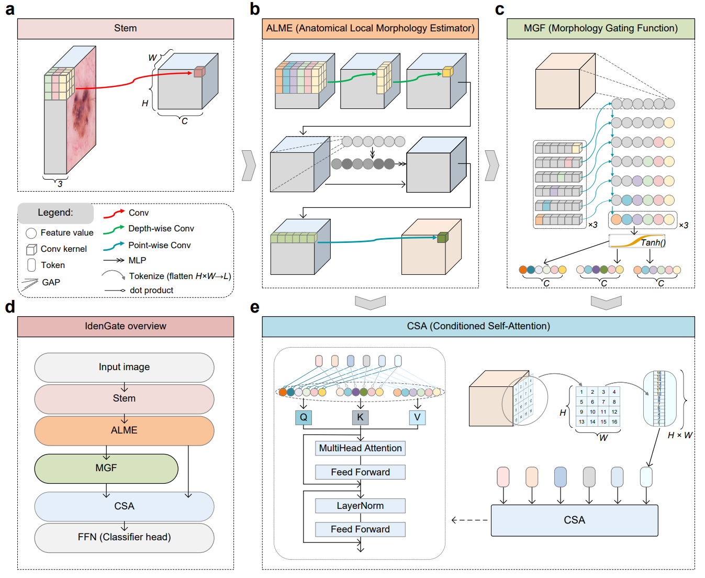
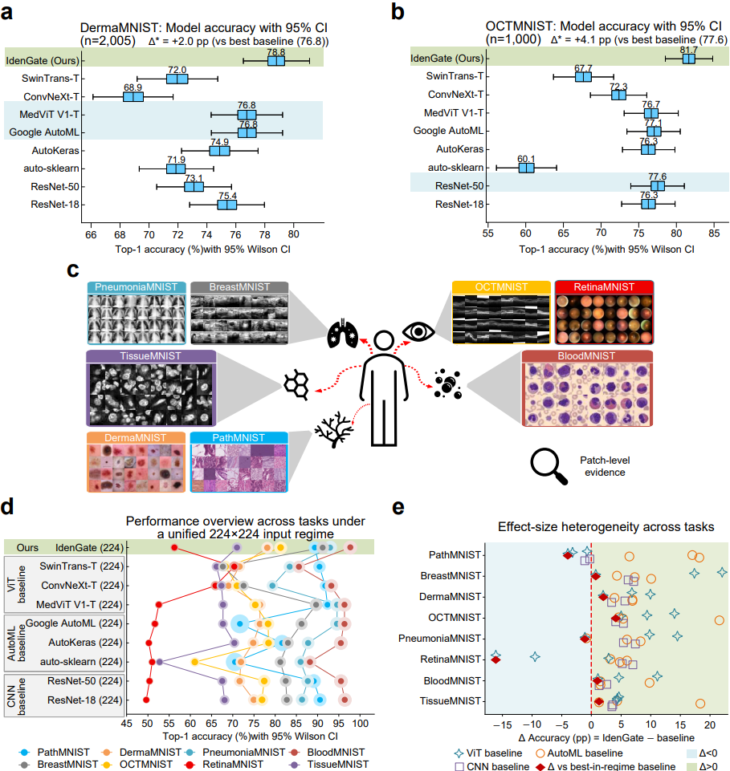

# Near-identity gating aligns model evidence and confidence in medical imaging

📌 **IdenGate** is a morphology-conditioned, near-identity inductive bias that stabilizes self-attention by gating token embeddings before the Q/K/V projections.
It improves **calibration** and **risk–coverage**, yields more **lesion-centric evidence**, and better aligns **model confidence** with internal evidence—supporting **safer human–AI decision-making**.

## ⭐ Abstract

Deep models can be confident for the wrong reasons: under shortcut learning, internal evidence (class-activation maps) drifts from causal structure while predictions remain overconfident. We introduce IdenGate, a morphology-aware inductive bias that geometrically stabilizes self-attention via near-identity gating of token embeddings feeding Q/K/V; gate strength interpolates to the unconditioned baseline at zero, preserving expressivity while steering aggregation toward contiguous morphology. Across eight MedMNIST tasks and three external clinical datasets, IdenGate improves calibration and risk-coverage and yields more lesion-centric evidence. In a randomized cross-over reader study on RetinaMNIST (400 readings), AI assistance increased clinician confidence by 3.94 points (95%CI 1.52–6.36) without increasing decision time (-0.19 s, 95% CI -1.10 to 0.79) and improved clinician confidence–accuracy calibration (ECE13.2%→7.0%). Weak, near-identity structural constraints can thus align evidence and confidence, offering a general route to safer human–AI decision support.

## 💡 Key Features

- A morphology-conditioned, near-identity gating mechanism that intervenes before Q/K/V projections to stabilize self-attention, while leaving the attention operator unchanged and enabling falsifiable, post-training mechanistic tests via a single gate-strength parameter.
- Evidence–confidence alignment rather than capacity inflation: IdenGate improves calibration, risk–coverage, and lesion-centric evidence aggregation across eight MedMNIST tasks and three external clinical datasets, with task-dependent gains consistent with morphology-driven reliability.
- Human-validated decision support benefits: in a randomized cross-over reader study on RetinaMNIST, IdenGate-assisted evidence increased clinician confidence without increasing decision time, improved confidence–accuracy calibration, and reduced safety-critical high-confidence errors.

## 📊 Results

## 📦 Data Preparation and Model Evaluation
**MedMNIST**: The dataset can be found **[here](https://medmnist.com/)**.

**Fetal-Planes-DB**: The dataset can be found **[here](https://zenodo.org/records/3904280)**.

**CPN X-ray**: The dataset can be found **[here](https://data.mendeley.com/datasets/dvntn9yhd2/1)**.

**PAD-UFES-20**: The dataset can be found **[here](https://data.mendeley.com/datasets/zr7vgbcyr2/1)**.

**RetinaMNIST_224**: The dataset can be found **[here](https://drive.google.com/file/d/1073VltJ3iwURdtSqMyG7qlIKpkakfp7S/view?usp=sharing)**.

We provide RetinaMNIST_224 as a lightweight demonstration dataset.
To run the demo, simply place the dataset in the eval folder and execute eval.py.
An example output file, eval_results_example.csv, is also provided for reference.

Please note that the main codebase is developed and trained in a Linux environment, using two NVIDIA RTX 5090 GPUs.
For demonstration convenience, we adapt the eval.py script to be compatible with Windows environments.

